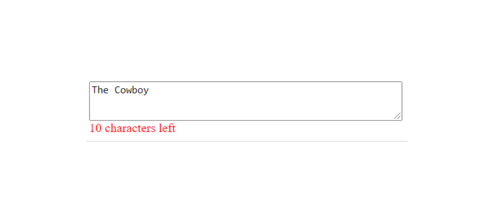

# Input-Field-Character-Counter
DOM selection and manipulation with input fields and updating getting values from form inputs using JavaScript. Turn red when the max numbers of characters is reached.

# Image 

